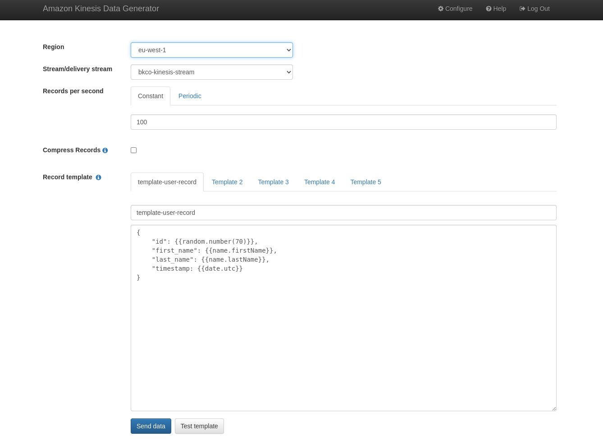

# cdk deployment

## setup kinesis streams and cloudwatch alarm directly on kinesis metric
```
1.  Kinesis stack (most of it) was copied from:
        https://github.com/aws-samples/streaming-solution-aws-cdk/
        
2.  Kinesis Data Generator Tool (KDGT) was installed from:
        https://awslabs.github.io/amazon-kinesis-data-generator/web/help.html
        
3.  Application was deployed to an AWS account that was already "bootstrapped" for CDK purposes.
    See "setup barebones app from scratch", if you need to do that in an account. Details at bottom of README.
    NOTE: Scout dev environment should NOT have the aws-cdk setup globally.
       
4.  Deploy application:
        cd /path/to/kinesis-stream-and-cloudwatch-alarm/deploy
    Check aws keys working:
        aws s3 ls
    Deploy via command line:
        export TELEPHONE_NUMBER=+12341234   // insert your sms number into shell
        cdk deploy
        cdk deploy --outputs-file ./cdk-outputs.json    // alternative
    OR deploy via Makefile:
        TELEPHONE_NUMBER=+12341234          // Makefile contains variable
        make deploy-to-aws
    Or deploy and get stack outputs:
        cdk deploy --outputs-file ./cdk-outputs.json
        
5.  Login to KDGT and trigger the "writeProvisionedThroughputExceededAverage" exception:
    Send 3000 requests per second to the stack.
    Example:
        {
            "id": {{random.number(70)}},
            "first_name": {{name.firstName}},
            "last_name": {{name.lastName}},
            "timestamp: {{date.utc}}
        }
6.  Wait for writeProvisionedThroughputExceededAverage exception to occur on kinesis.
    Stack sends an SMS message to you.
    Stop KDGT. 
7.  Unit testing application cloudformation resources:
        cd /path/to/kinesis-stream-and-cloudwatch-alarm/deploy
        npm test
    Look at the terminal console output and grab JSON written out. JSON is generated by the unit test
    "'Log of generated cloudformation resources we can test'". Prettify text in a text editor.
    Add additional tests as you see fit.
8.  Delete AWS resources:
        cdk destroy
```

## Kinesis Data Generator Tool


## setup barebones app from scratch
```
1.  Check node and nvm are setup:
        nvm -v
        node -v
2.  install cdk globally (makes it easy to init a vanilla cdk project):
        nvm list
        nvm alias default v16.14.0      // use an LTS release
        npm install -g aws-cdk@2.x      
        nvm use v16.14.0
    understand where global packages are installed:
        npm root -g                     // /home/$USER/.nvm/versions/node/v16.14.0/lib/node_modules
    check:
        cdk --version
3.  use cdk to init project:
        cd github-project-directory
        mkdir app
        cd app 
    project init options listed by:
        npx cdk init --list
    options are:
        cdk init app --language typescript
        cdk init lib --language typescript
        cdk init sample-app --language typescript
    but use this one:
        cdk init sample-app --language typescript  // must be run in empty directory
    that creates a /bin/app.ts file (because we named the directory "app") .... perfect.... rename the "app" directory to "deploy" now
        cd ..
        mv app deploy
        cd deploy
        npm test
4.  Bootstrap your AWS account so that cdk can deploy resources in it.
    Do this if its the first time you are deploying with CDKv2 (as opposed to v1).
        awse bkco       // personal command to setup keys
        aws s3 ls       // check your keys are working
        cdk bootstrap aws://<your-account-number>/<your-region>
        cdk bootstrap aws://123441421234/eu-west-1      // creates CDKToolkit cloudformation stack
5.  Supply environment args to app.ts via:
        new AppStack(app, 'AppStack', {
        stackName: "my-app-stack",
            env: {
                account: process.env.AWS_ACCOUNT || '123441421234',
                region: process.env.AWS_REGION || 'eu-west-1',
        }});
    NOTE: process.env.* syntax allows Makefile's to pass in variable values
6.  Deploy sample app to account:
        cdk synth
        cdk deploy
    Verify resources deployed:
        aws sns list-topics --region eu-west-1
        aws sqs list-queues --region eu-west-1
7.  Understand how we can edit lib/app-stack.js and preview what will happen.
    For example remove sqs and sns code from that file.... just leaving the boilerplate code.
    Then:
        cdk diff
    Proceed with cleanup:
        cdk destroy
```